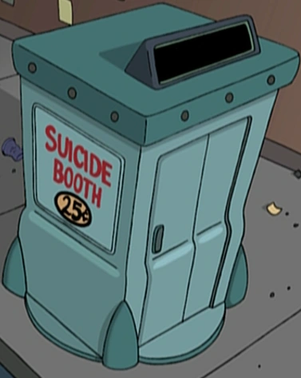

# suicidebooth
Erase your social media profiles

## Description
Tools to archive or hide posts on your Facebook profile timeline — console script and a browser extension POC.

## Browser extension (recommended)

**How to use (desktop + Android/Quetta):**  
→ **[documentation/howto-extension.md](documentation/howto-extension.md)**

**Download:** [dist/suicidebooth-extension-v0.1.1.zip](dist/suicidebooth-extension-v0.1.1.zip)  
Unzip → load unpacked in Chrome/Brave/Edge, or install in [Quetta](https://www.quetta.net/) on Android. Always use Facebook’s **mobile** layout on your **profile timeline**.

Short notes: [extension/README.md](extension/README.md)

## Console script (fallback)

- On a desktop browser (tested on Brave) open developer tools
- On the devices options, select iPhone SE (any other phone size should work as well)
- Go to your Facebook profile timeline
- Open the console and paste the contents of `src/index.js`
- Sit and relax (only supporting "slow and horrible" mode for now; if the script stops, run `archiveOrHide()` in the console to resume)
